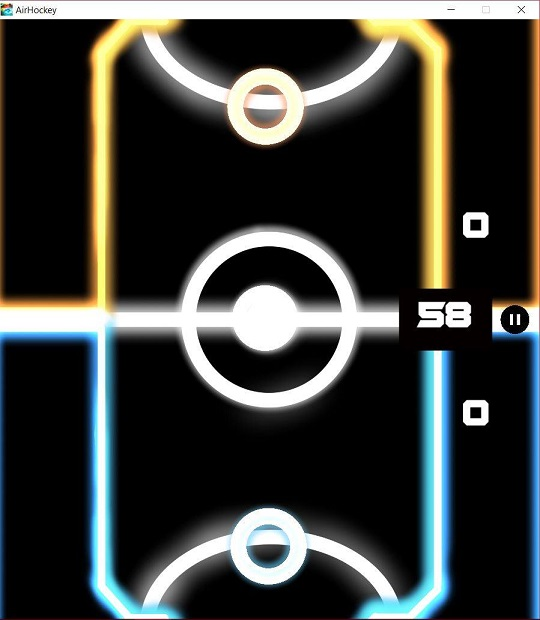

# AIRHOCKEY GAME
## AirHockey

Our AirHockey is 2D arcade game that playe have to hit a puck into enemy's goal with a limit time. While the game is playing there will be a 2 type of special puck that spawn in the middle of the scence. Which are buff and debuff special puck. To get a special puck action player have to hit a special puck in his goal. For example if player hit debuff puck to enemy goal the enemy will get a debuff action but if player hit a buff puck to his goal the player will get action of buff puck

### Mainmenu  

### Select AI level    

### In Game Screen shot

### Score board

## Installation
| Platform           | URL              | How to Install   |
|:------------------------|:-------------------|-----------------|
| Window  |         [Click](https://github.com/BasPasut/AirHockey/tree/master/Build/Window/x86) | Download the zip file from URL and extract it.        |
| Linux     |         [Click](https://github.com/BasPasut/AirHockey/tree/master/Build/Linux/x86) | Download the zip file from URL, and extract it. Right click at the .x86 or .x86_64 file, then Go to properties, and Go to Permission tab. Tick “Allow executing file as program” box. Run file as normal.        |
| MacOSX      |         [Click](https://github.com/BasPasut/AirHockey/tree/master/Build/Mac/x86) | Download the zip file from URL and extract it.        |

| Counter class           | Limit              | Runtime (sec)   |
|:------------------------|:-------------------|-----------------|
| Unsynchronized counter  |         10,000,000 | 0.015469        |
| Using ReentrantLock     |         10,000,000 | 0.760960        |
| Syncronized method      |         10,000,000 | 0.713760        |
| AtomicLong for total    |         10,000,000 | 0.253438        |

###### For the program's UML [here](https://drive.google.com/file/d/1IDuIlmwj7wHP3FxDT8Iok7lnlQzWYss1/view?usp=sharing).

## What we have use in this project from OOP2 Class

- Strategy design pattern
- Polymorphism

## What we have learn more from this project

- Object pool design pattern
- C## language
- Unity program
- Dreamlo Online DataBase

## Interesting Tech that we learn from this project

- Component in Unity
  - In Unity, you can change your image into gameObject by just adding feature(Component) in your image.
